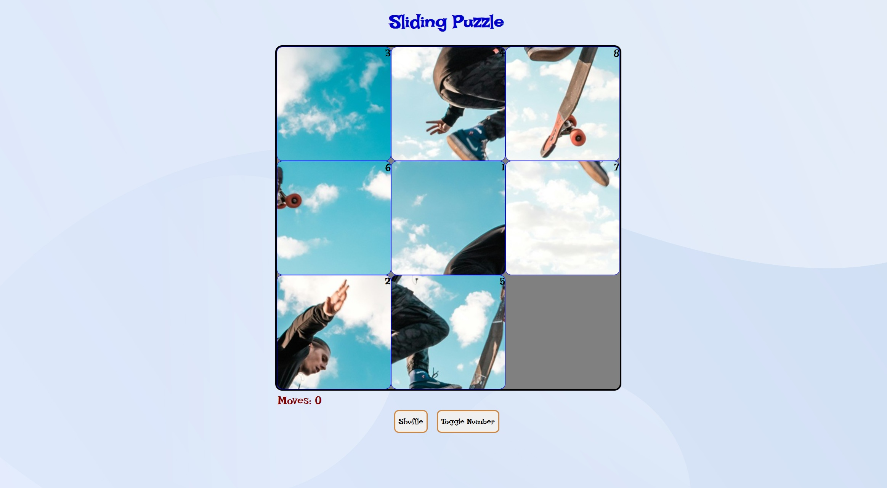

# Slide Puzzle Game (3×3)

A simple and interactive 3×3 Slide Puzzle Game implemented in JavaScript. The game features tile animations, a move counter, puzzle shuffling using the Fisher–Yates algorithm, solvability correction via inversion counting, and control buttons for shuffling and revealing tile numbers.

## 🎮 Game Features

🔹 **3×3 Sliding Puzzle**

The classic sliding puzzle consists of 8 movable tiles and 1 empty space. The goal is to rearrange the tiles into numerical order.

🔹 **Smooth Tile Transitions**

CSS transitions are applied to animate tile movements when the player clicks a tile adjacent to the empty space.

🔹 **Move Counter**

Every valid slide increments the number of moves. The counter resets on shuffle.

🔹 **Shuffle Button**

- Randomizes the board using the Fisher–Yates shuffle.

- Ensures the resulting puzzle is solvable.

- Resets the move count.

🔹 **Toggle Number Button**

A helper function that reveals the tile numbers. Useful for assisting players.

## 🔢 Puzzle Solvability Handling

The game ensures that every shuffled puzzle can be solved.

✔️ **Fisher–Yates Shuffle**

Used to generate a uniformly random permutation of the tiles.

✔️ **Inversion Counting**

After shuffling, the game:

1. Counts the number of inversions in the tile sequence.

2. Determines if the puzzle is solvable.

3. If unsolvable, it fixes the issue by either swapping:

   - The first two tiles of the swapped sequence, or

   - The last two tiles, depending on the location of the empty tile.

This guarantees that the final shuffled board is always solvable.

## 📁 Technical Summary

- **Tech stack:** HTML, CSS, and JavaScript

- **User Interaction:** Tiles are moved using mouse clicks. A tile will only move if it is adjacent to the empty tile (up, down, left, or right).

- **Language:** JavaScript (ES6)
- **Logic:** Fisher–Yates shuffle, inversion counting
